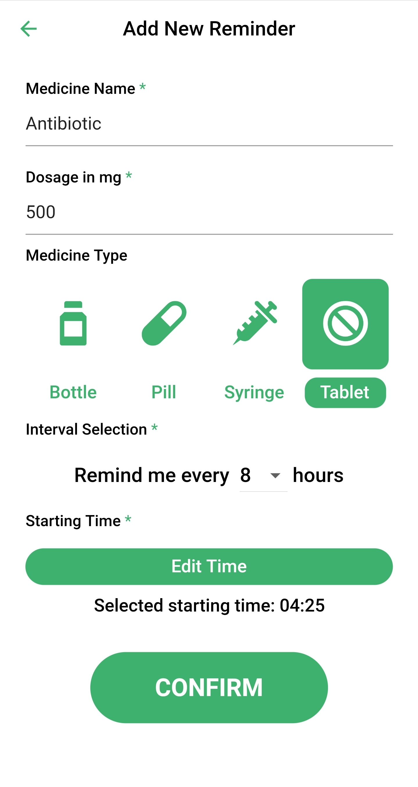
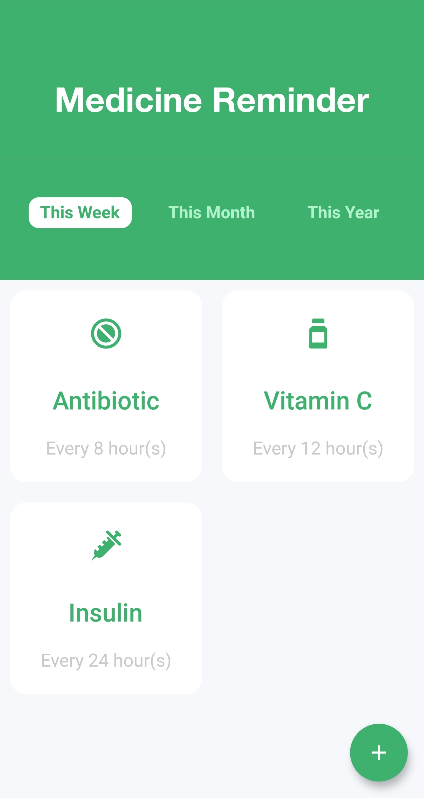

# Medicine Reminder

An offline medicine reminder, built with Flutter, Provider and BLoC pattern.

## Current Features
[✓] Shared preference data storage

[✓] Homepage medicine list

[✓] Register a new reminder

[✓] Interval picker

[✓] Optional medicine symbol choice

[✓] Individual medicine detail page

[✓] Beautiful UI

## TODO List

᛫ Notification implementation

᛫ Registeration error checking

᛫ Delete a reminder

# Screenshots

  
  

